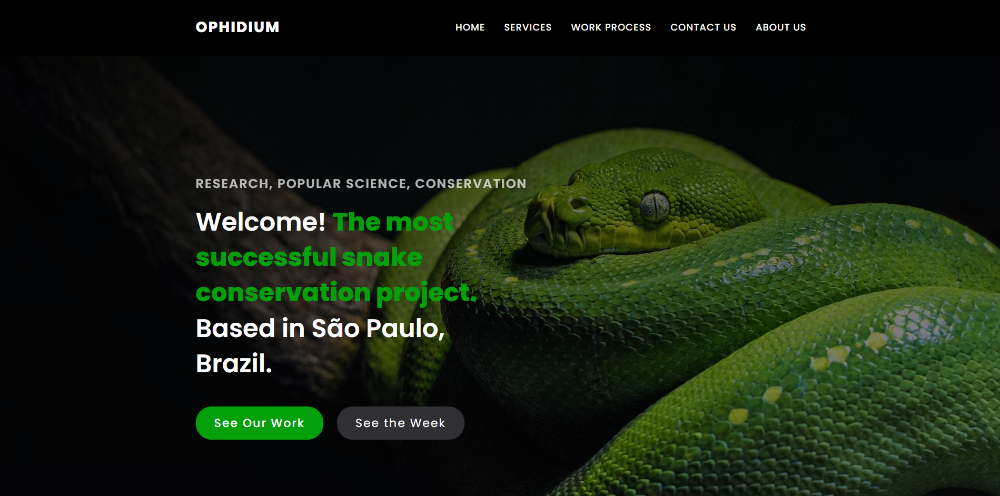

# Projeto Front-end - Ophidium

This is my frontend project for the Full Stack Web development course that I'm taking at [FLAG](https://flag.pt/curso/full-stack-web-developer).

## Conteúdo

- [Uso](#uso)
  - [Instalar Dependências](#instalar-dependências)
  - [Run CRA](#run-CRA)
- [Geral](#geral)
  - [Contexto](#contexto)
  - [Desafio](#desafio)
  - [Produto Final](#produto-final) -[Screenshot](#screenshot)
- [Processo](#processo)
  - [Feito com](#feito-com)
  - [Technics and Tools](#technics-and-tools)
- [Improvements and Future](#imporvements-and-future)

## Uso

Como iniciar o projeto:

### Instalar Dependências

`npm install`

### Run CRA

A app será executada em: http://localhost:3000

`npm start`

## Geral

### Contexto

Frontend project for my course at [FLAG](https://https://flag.pt/curso/full-stack-web-developer).

Requisitos do projeto:
- Uso de React;
- Pelo menos 2 hooks,
- Elaborar um CRUD;
- Uso de API externa ou dummy;
- Boa semântica de HTML e CSS adequado;
- Utilização de rotas;
- Um simples formulário de validação;
- State managemente (extra positivo, opcional). 
  

### Desafio

O cliente é um centro de pesquisa e divulgação científica focado em serpentes. 
O solicitado foi uma plataforma que o público possa acessar afim de obter informações sobre estes animais, suas famílias e várias espécies e subespécies. A plataforma deve ter um design simples porém elegante, de interação dinâmica e fácil entendimento para pessoas de qualquer escolaridade. 

### Produto Final

Uma app React semi-SP(Single-page) com:

- Homepage: Contendo seções com as principais informações sobre a instituição e a plataforma, como serviços prestados, espécies de serpentes mais procuradas, formulário de inscrição em Newsletter, apresentação do trabalho e como ele é feito. Conta também com uma seção Testimonials, exibindo organizações pelas quais o centro de pesquisa é reconhecido. As seções são navegáveis de forma dinâmica através de um menu na Navbar e botões no Header.
  
- About page: Contendo conteúdo informátivo sobre o propósito do centro de pesquisa e uma Weather API com base em localização aproximada.

### Screenhot

## Process

### Feito com

- Semantic HTML5 markup
- CSS
- Javascript
- Sass
- React
  

Some Dependencies
- React Icons
- React Spinners
- Framer Motion
- Swiper
- React Hook Form
- React Toastify
- Yup
  

### Technics and tools

Here are some of the technics and tools used in this project

Slider and carousel:
- For this type of challenge, different approaches were used.
  - Stats Carousel: pure CSS.
  - Blog carousel in homepage: Swiper library.
  - Home hero slider: JavaScript and Css.
    

FAQ Accordion:
- Framer Motion library.
  
Weather Report in Event capital
- Use of external OpenWeather API.
  
Blog CRUD:
- Use a dummy API with JSON server to get, add, update, and delete blog posts.
  
Form with validation:
- Use of Hook Form and Yup.
  

"Dropdowns" on click:
- For this challenge, also different approachs were used.
  - Packs "dropdown": useState and UseEffect.
  - Event "dropdown": use of an outlet component to render the Event page.
    

Routes:
- Use of react router dom. Choosen functions:
  - Route
  - createBrowserRouter
  - createRoutesFromElements
  - RouterProvider

Some react hooks were used in the project.
In the majory of cases, from changing images displayed, toggling color themes, to scroll to top on page change, or triggering of transitions, useState and/or useEffect were used.

## Improvements and Future

Improvements:
- Create a State Management either with context API or Redux.
- Create an login routing for admin and user, so only admins can see and acess the CRUD
- Use backend to feed the entire applications
- Add cookies, privacy, packs and events purchase and payment.
- Better and more advanced design, CSS and JavaScript.
  

Future:
- With more 5 to 6 months of classes, this time backend, I intent to use the knowledge obtained in those classes to add these improvements to the application, and make it a finished product to the client.
- With this improvements, and with the implementation of backend requirements, this application will much probably be used in the backend project as well, and after that integrate my portfolio.
